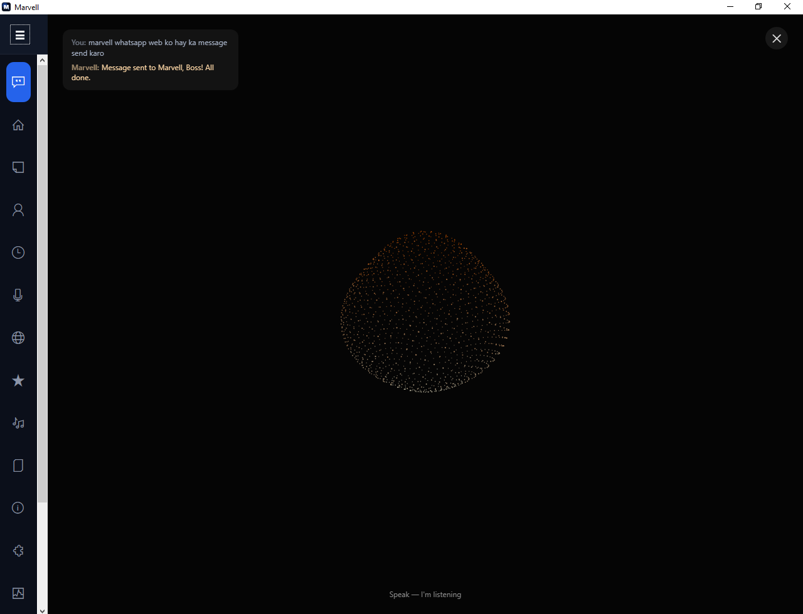
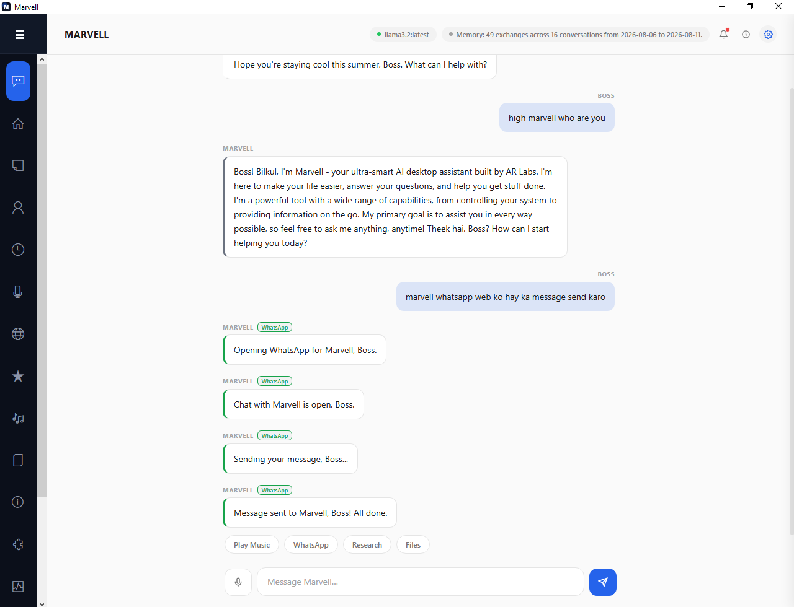

# Marvell AI

  

  
  
  
  

<b>A personal AI desktop assistant for Windows</b> — chat, voice, and a huge set of built-in agents for everyday tasks, backed by a local LLM (via <a href="https://ollama.com">Ollama</a>) with optional Google Gemini fallback for when you want more power.

Built by <b>Venom</b>.

> This repository ships the packaged Windows application only. Source code is not published here.

---

## 📥 Download

Grab the latest build from the **[Releases page](../../releases/latest)** → download the `.zip` → extract it anywhere → run `Marvell_AI.exe` from inside the extracted folder.

No installer, no admin rights needed — it's a portable app. On first run, Windows SmartScreen may warn about an unrecognized publisher (normal for apps not code-signed by a commercial certificate) — click **"More info" → "Run anyway."**

## ✨ What it does

Marvell is an always-on assistant that lives in your system tray and understands both typed and spoken commands.

  

| | |
|---|---|
| 🗣️ **Chat & Voice** | Type or talk to it; wake-word and push-to-talk support; an "Immersive Voice" mode with a live audio-reactive 3D visualization for hands-free conversation. |
| 🧠 **Local-first AI** | Runs on a local Ollama model by default (private, no internet needed for basic chat), with an in-app model downloader and an optional Gemini fallback for tougher questions. |
| 💬 **Messaging** | WhatsApp, Telegram, Slack, Discord — read, reply, and automate. |
| ✅ **Productivity** | Reminders, calendar, email, notes, habit tracking, journaling, recurring automation rules. |
| 📁 **Files & media** | File creation, image generation, video/audio tools, screen recording. |
| 👨‍💻 **Dev tools** | Code generation (with a dedicated coding model + copy-paste-ready code blocks), git helpers, a sandboxed scripting console. |
| 🖱️ **Computer use** | Can look at your screen and carry out a task via mouse/keyboard, narrating each step with a hard step limit for safety. |
| 🏠 **& more** | Smart home, shopping/price tracking, market prices, focus/Pomodoro mode with distraction-site blocking, and dozens more agents. |
| 💰 **Finance** | Budgets, subscriptions, savings goals, invoices, loan/mortgage calculator, net worth, investment & crypto portfolio tracking. |
| 🛡️ **Security & wellness** | Breach monitoring, screen-lock automation, secure file shredder, sleep/mood tracking, guided breathing exercises, document expiry reminders. |
| 🎓 **Learning** | Language tutor with spaced-repetition quizzes, study plans, debate practice, daily trivia. |
| 📊 **Dashboards** | Usage/cost analytics, model response-time benchmarking, wellness trend correlation. |

### Privacy controls

- **Dry-run mode** — preview what an action would do before it actually happens.
- **Guest mode** — hard-blocks anything that sends/writes/controls something, for letting someone else use it safely.
- **Opt-in clipboard history** — off by default, since it can capture sensitive text.
- **Local API** — an optional local REST endpoint (off by default, token-protected) for scripting Marvell from other tools, plus a browser extension for sending page content or a right-click selection straight to it.

## 🖥️ System requirements

- Windows 10/11 (64-bit)
- For local AI: [Ollama](https://ollama.com/download) installed, with at least one model pulled — Marvell will detect this and help you download a model on first run
- A microphone, if you want to use voice features

## ❤️ Support this project

Marvell is free to use. If it's saved you time and you'd like to support development, donations are welcome:

**USDT (Binance Pay ID):** `92555348`

Not required, always appreciated. 🙏

## 📄 License

See [LICENSE](LICENSE) for usage terms.

## 🐞 Feedback

Found a bug or have a feature request? Open an [issue](../../issues).
